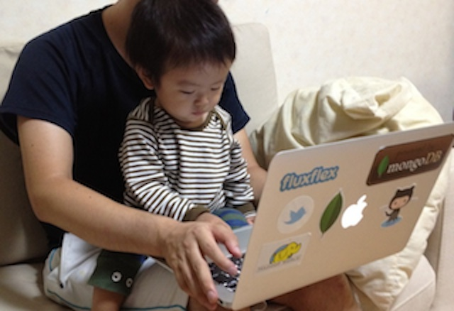
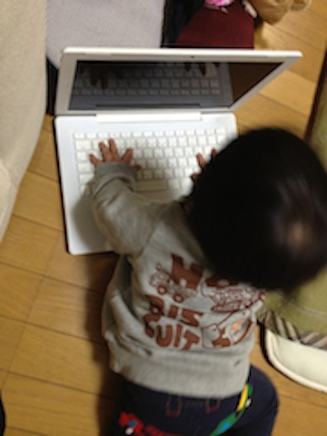
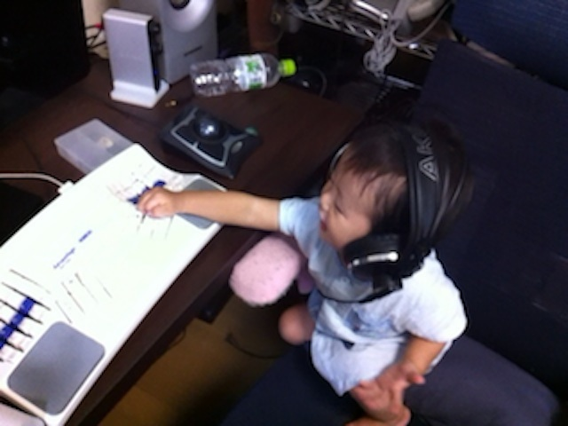
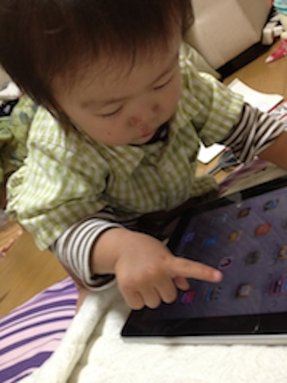

################################
子育て中の勉強時間の確保について
################################

.. author:: default
.. categories:: family, childrenac
.. tags:: none
.. comments::

********
はじめに
********

本エントリーは `子育てエンジニア advent calendar 2012 : ATND <http://atnd.org/events/34177>`_ に参加しています。

アドベントカレンダーの趣旨
==========================

なぜこのアドベントカレンダーをやろうと思ったかについてです。

勉強会などで子育て中のエンジニアの方とお会いすると、技術の話をよそに子どもの話ばかりになった割りとあるんですね。話の内容にあるあると思うこともあれば、自分とは全く違う経験をされていることもあって、楽しく話をさせてもらっています。

やはり子どもがいると生活のかなりの部分は子どもに関わることで占められますし、子どもはどんどん大きくなって新鮮なことばかり起きるので、子どもを通してみなさん大なり小なり色々と思うところがあるんだと思います。

ですが、僕の場合ですとブログのメインが技術の話題なので、中々子どものことについてまとまった文章を書く機会はありません。こういう人は結構多いんじゃないかと思います。

そこでこういう機会を設けること普段の思いの丈を存分に解き放っていただくとともに、集まった記事を眺めてニヤニヤしたい、というのがこのアドベントカレンダーの趣旨です。

一応この記事はエンジニアっぽいテーマになっていますが、別にどんな話題でも構いません。みなさんの親ばかぶりを期待しています。

**********************
勉強時間の確保の困難さ
**********************

私はエンジニアとして某社で働いているんですが、帰宅してからの時間で、調べ物をしたり個人的なコードを書き進めたいことがあります。

ところで私には息子が一人いて最近一歳半になったのですが、寝転がるしかできなかったのは遥か昔のことのように、家中を歩きまわっています。

その息子がキーボードが大好物でして、家でキーボードを叩いていると、高確率でこうなったり

こうなったり

挙句の果てにはこうなったりします。

ちなみにiPadも好きで、まだ喋れないんですが、iPadが欲しい時は指一本でタッチしているジャスチャーで要求してきます。デジタルネイティブというやつでしょうか。

将来のハッカーとしての片鱗を見せていて親としては嬉しい半面、これではとても作業はできないですね。

これに加えて、お風呂に入れたりご飯を食べさせたりとやることは山積みです。

結婚すると個人の時間は減ると言われますが、子どもができてからに比べると遥かに余裕があったように思います。

そんな状況の中で何とか隙を見つけて時間を確保したいところです。

やり方候補
==========

今まで試した方法を何となくまとめてみました。

1. 一緒にいても何とか時間を見つけるよ派

    1. 子どもが寝てからやるよ派
    2. 子どもの面倒をみながらできることを探すよ派
    3. 心を鬼にするよ派

2. 一緒にいる時間は諦めるよ派

    1. 通勤中にやるよ派
    2. 会社でこっそりやるよ派
    3. どこかに寄ってやるよ派

1. 一緒にいても何とか時間を見つけるよ派
---------------------------------------

何だかんだ言っても子どもは可愛いし一緒にいたいので、一緒にいながら勉強する方法を模索する道です

1.1. 子どもが寝てからやるよ派
^^^^^^^^^^^^^^^^^^^^^^^^^^^^^

王道ですね。子どもが寝てからの自由の身で思う存分勉強します。私もメインの路線はこれ狙いです。

子どもの寝付き具合に左右されるのと、自らの睡眠時間に左右されるのが欠点ですね。

ところで私はこの方法でやる時は、自分も布団に入って入ってうつ伏せになりながら作業をすることが多いのですが、顎に負担がかかるのかバキバキいうことがことが増えてきました。他の姿勢を模索したいところです。

1.2. 子どもの面倒をみながらできることを探すよ派
^^^^^^^^^^^^^^^^^^^^^^^^^^^^^^^^^^^^^^^^^^^^^^^

最近はnexus7を買ったので、これに電子書籍、論文、ソースコードを入れたりして気になるところ空いた時間でちょっとずつ読んでみています。

とはいえまとまった量を読むことはできないので、事前に知りたいことを頭の中で整理しておくといい気がしますね。

妨害がしょっちゅう入るのであまり効率はよくないです。

1.3. 心を鬼にするよ派
^^^^^^^^^^^^^^^^^^^^^

息子の誘惑を断ち切って没頭します。緊急時用ですね。

2. 一緒にいる時間は諦めるよ派
-----------------------------

一緒にいる時に時間を確保するのは難しいので、そうでない時間を利用します。この方法は、そもそも早く帰って子どもに会いたいという自己矛盾を抱えることになります。

2.1. 通勤中にやるよ派
^^^^^^^^^^^^^^^^^^^^^

王道ですが、私の場合ですと、電車にのる時間が短かいのであまり効率よく進められないです。1.2.の方法の続きをそのまま始められるのでその点はいいですね。

2.2. 会社でやるよ派
^^^^^^^^^^^^^^^^^^^

会社の仕事を終わらせた後に居残って自分の作業をしたり、待ち時間に調べ物をしたりします。当然ながら会社では会社の仕事が優先なので、積極的に時間を確保できるわけではないですね。

2.3. どこかに寄ってやるよ派
^^^^^^^^^^^^^^^^^^^^^^^^^^^

会社帰りにどこかに寄ってみたこともあるんですが、お金もかかるしあまり集中できないしで、それなら早く帰った方がいいという結論にいたりました。

******
まとめ
******

色々試しましたが、家での勉強は諦めて家では子どもとの時間を楽しむのが一番ですね。それでは。
