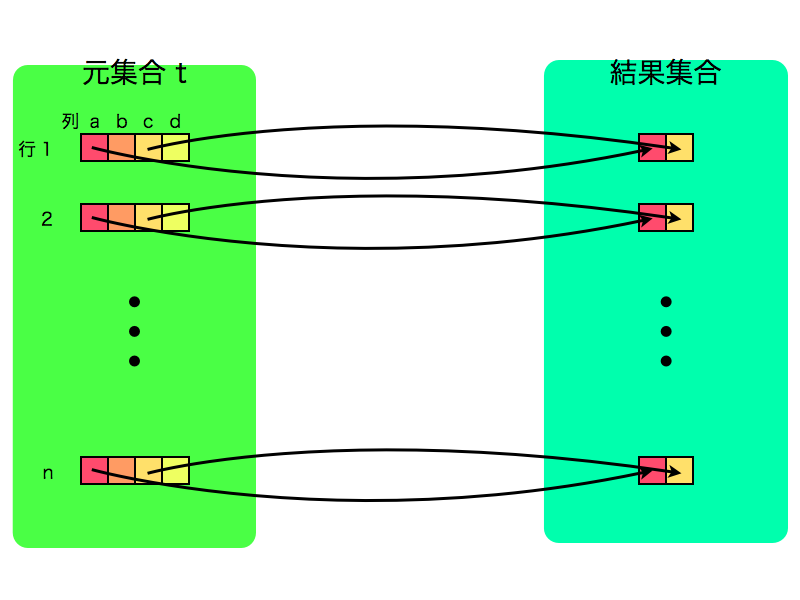
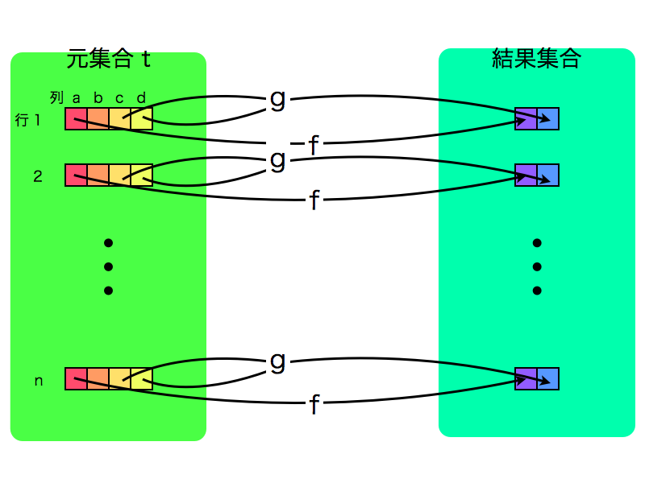
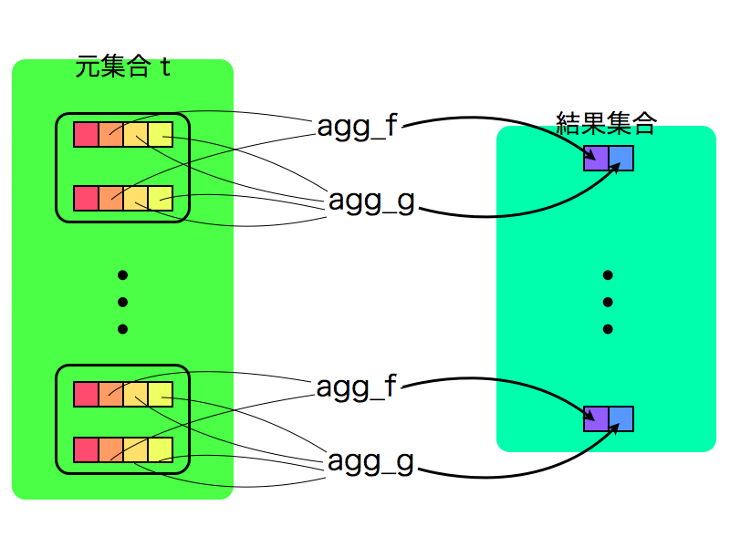
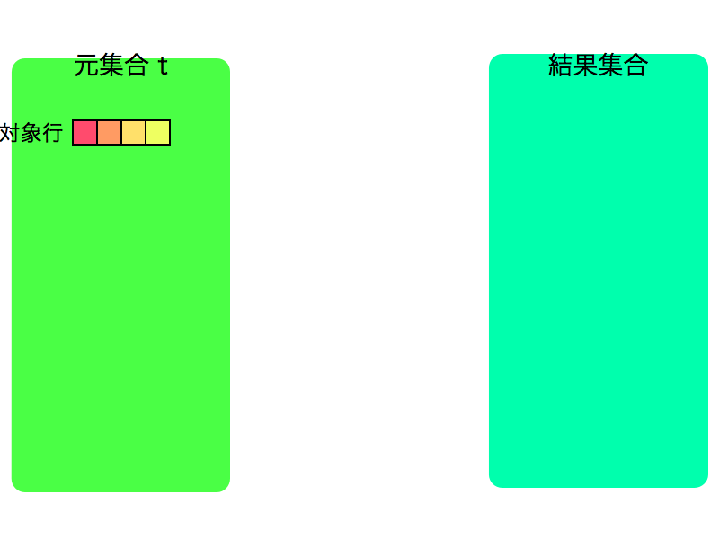
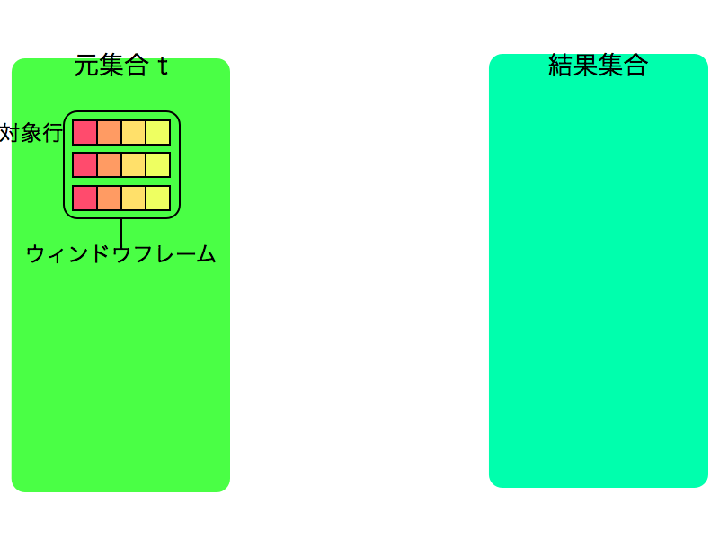
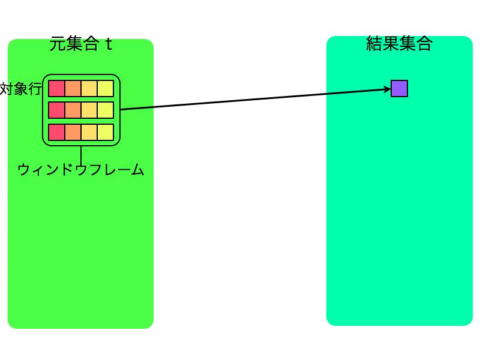
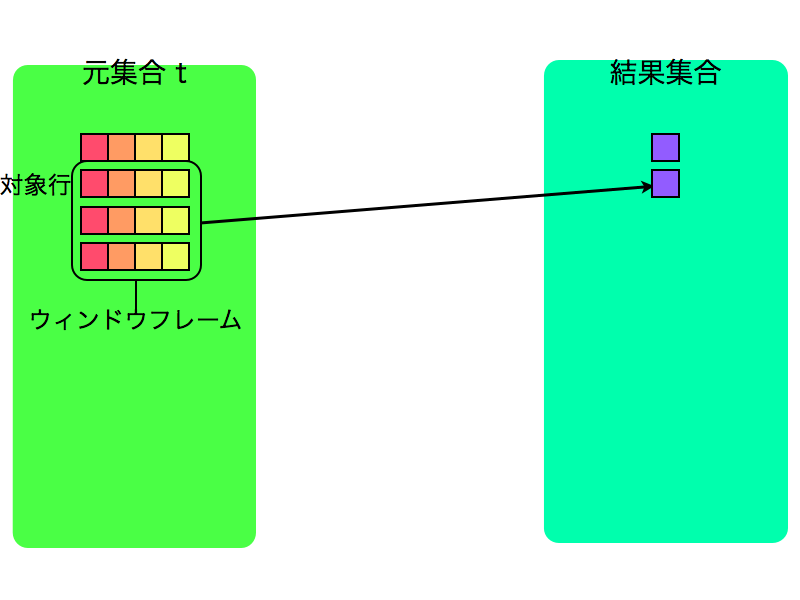
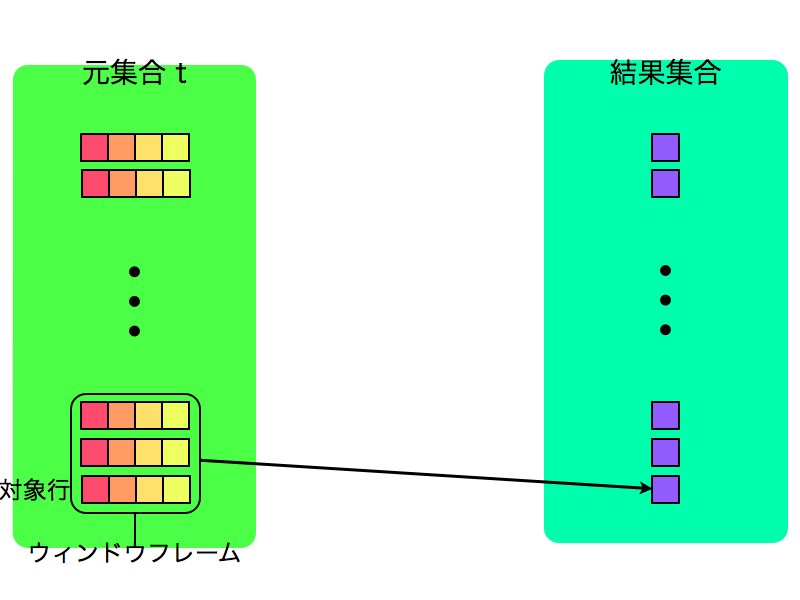

###################
Window関数 - 導入編
###################

.. author:: default
.. categories:: PostgreSQL
.. tags:: none
.. comments::

********
はじめに
********

本エントリーは `PostgreSQL Advent Calendar 2012 <http://atnd.org/events/34176>`_ に参加しています。

本エントリーではWindow関数がどういうものか、SQLでどう表すかについて説明します。

****************
Window関数とは？
****************

SQLにはWindow関数と呼ばれる機能があります。SQL:2003で定義されており、PostgreSQLには8.4から導入されています。

Window関数がどういうものかというと、wikipediaを見ると次のように書いてあります。

    SQL において、窓関数もしくはウィンドウ関数 (英: window function) は結果セットを
    部分的に切り出した領域に集約関数を適用できる、拡張された SELECT ステートメントである。
    
    `窓関数 (SQL) <http://ja.wikipedia.org/wiki/%E7%AA%93%E9%96%A2%E6%95%B0_(SQL)>`_ より引用

分かったような分からないような説明ですね。

確かに上の説明の通りではあるのですが、なぜ必要になるのかを順を追って説明します。

SELECT
======

まずは基本からおさらいです。SQLで値を取得するにはまずSELECTですね。

**通常のSELECT句では元集合と結果集合の行が1対1で対応しています**

図で表すと以下のようなイメージです。

.. code-block:: postgres

    SELECT a, c FROM t

SELECT句では関数や演算子を用いて新たな列を定義することもできます。
関数の引数は一つの列の場合も、複数の列の場合もあります。

.. code-block:: postgres

    SELECT f(a), g(c,d) FROM t

関数や演算子を使うことで様々な行を定義できますが、結果集合は一行は元集合と一行からのみ作られるという点は変わりません。

集約とGROUP BY
==============

では複数の行から一つの行を作りたい場合はどうすればいいかというと集約ですね。

**集約では元集合中のある部分集合と、結果集合の一つの行が対応します**

集約を行う際にはGROUP BYによって部分集合を定義します。

GROUP BYを省略すると部分集合は元集合全体になります。

イメージとしてはこんな感じ。

.. code-block:: postgres

    SELECT agg_f(b), agg_g(c,d) FROM t GROUP BY a

集約では元集合の複数行を用いて結果集合の行を定義できますが、元集合の複数行が結果集合では一行となり、全体の行数は減ってしまいます。

Window関数
==========

例えばSQLでデータ解析をしているとして、集約では集合全体の特徴を知ることはできますが、それぞれの行が全体の中でどういう立場にあるかということは調べられません。

それを計算するために、元集合と結果集合の行を1対1で定義したいけど、結果集合の行は元集合の複数の行の値を使って計算したい、という欲求が出てきます。

それSQLで実現するのがまさにWindow関数です。

**Window関数では元集合と結果集合が1対1で対応しますが、元集合の一行をもとに定義されるある部分集合を使って、結果集合の一行を定義できます**

ややこしいですね。この部分集合のことをウィンドウと呼びます。（正確にはウィンドウフレームです。後述します。）

イメージを図示すると、まず元集合中の一行が対象行として選ばれます

次に対象行からある部分集合（ウィンドウフレーム）が定義されます。

部分集合から結果集合の一行が計算されます。

以上を元集合の全行に対して繰り返します。

元集合と結果集合の行はあくまで1対1で対応していながら、複数行を対象として計算していることがお分かりいただけたでしょうか。

何に使うの？
============

Window関数の使い道は様々なのですが、簡単な例では

* 連番
* ある列に基づくランクづけ
* 移動平均
* 累計
* 歯抜け値の検索

などが挙げられます。どれもある行と他の行の関係から導かれる値であることに注目して下さい。

このようにWindow関数は特に分析において重要な役割を果たすため、分析関数やOLAP関数と呼ばれることもあるそうです。

他、具体的な使い方はweb上に多く説明されていますので以下などを参照して下さい。

* "Window関数 — Let's Postgres" http://lets.postgresql.jp/documents/technical/window_functions
* "分析関数の衝撃：CodeZine（コードジン）" http://codezine.jp/article/corner/71

*****************
Window関数 in SQL
*****************

以上でWindow関数の概念はお分かりいただけたと思うので、ここからは実際にSQLにおいてWindow関数がどのように表現されるかを説明していきます。

その前準備としてWindow関数における構成要素を説明します。

パーティション
==============

まず元集合はある値にもとづいてMECEに分割されます。これを `パーティション` と呼びます。パーティションは元集合全体である場合もあります。

集約におけるGROUP BYのようなものだと思って下さい。

フレーム
========

パーティション内をある順番で並べた後に、対象行を中心としたある範囲を部分集合として取り出します。これを `ウィンドウフレーム` （あるいは単にフレーム）と呼びます。つまり、フレームは一行毎に定義されるものです。また、異なるフレームは重複しても構いません。

フレームは上記でも説明した通りWindow関数における計算の対象となるものです。（正確にはフレームを必要としないWindow関数も少数存在します）

以上をまとめると、包含関係としては

**元集合全体 ≧ パーティション ≧ フレーム**

となります。

構文
====

PostgreSQLにおけるWindow関数の構文は次のとおりです。

`window_function(arg) OVER window_definition`

window\_definitionによってパーティション、フレームが定められます。

window\_definitionは次の要素から成り立ちます。

PARTITION BY
------------

パーティションを定義します。GROUP BYと同じく、同じ値が同じパーティションになります。省略した場合は集合全体がパーティションとなります。

ORDER BY
--------

パーティション内における順番を定義します。省略された場合はシステム依存になるので、順番が意味を持つ場合は必ず指定して下さい。

frame\_clause
-------------

フレームを定義します。基本的な考え方としては、対象行を基準として範囲の開始と終了を指定する、というものです。

詳細な構文は以下を参考にしてください。

`4.2.8. ウィンドウ関数呼び出し <http://www.postgresql.jp/document/9.2/html/sql-expressions.html#SYNTAX-WINDOW-FUNCTIONS>`_

フレーム定義を省略した場合のデフォルトは `RANGE UNBOUND PRECEDING` ですので、パーティションの先頭から対象行までがフレームとなります。

ただし、ORDER BYとフレーム定義の両方が省略された場合は特殊で、パーティション全体がフレームになります。

例
==

構文は以上の通りですので、実際のSQLの構文がどういうwindowを定義しているかを見ていきます。

例1
---

.. code-block:: postgres

    SELECT row_number() OVER (), * FROM t

* パーティション
  * PARTITION BYが省略されているので集合全体
* フレーム
  * ORDER BYとフレーム定義の両方が省略されているのパーティション全体、つまり集合全体

row\_number()は連番をつけるWindow関数です。このSQLはテーブルt全体にわたっての連番をつけています。

例2
---

.. code-block:: postgres

    SELECT sum(number) OVER (PARTITION BY product ORDER BY date) FROM product_sales

* パーティション
  * prefectureが指定されているのでプロダクト別のパーティションになります
* フレーム
  * ORDER BYのみ指定されており、フレーム定義は省略されています。記録開始から対象の日付までがフレームになります。

このSQLではプロダクト別の累積の売上個数を日別で見たいようです。

ちなみにsumは通常で集約関数として定義されたものです。通常の集約関数は全てWindow関数として用いることができます。

例3
---

.. code-block:: postgres

    SELECT avg(number) OVER (ORDER BY date ROWS BETWEEN 3 PRECEDING AND 3 FOLLOWING) FROM page_access;

* パーティション
  * PARTITION BYが省略されているので集合全体
* フレーム
  * 日付で並べた後に、前後三日間、つまり対象日付を中心とした一週間がフレームとなります

このSQLでは、アクセス数の一週間ごとの移動平均を求めています。

******
まとめ
******

* Window関数を使えば元集合と結果集合の1対1の関係を保ったまま、複数行を計算の対象とすることができます

**********************
ユーザー定義Window関数
**********************

ところでPostgreSQLと言えば、その強力な拡張機能が売りであることは当然ご存知だと思います。

Window関数も例に漏れずユーザー定義で拡張することが可能です。次回はユーザー定義Window関数の書き方をご説明します。
