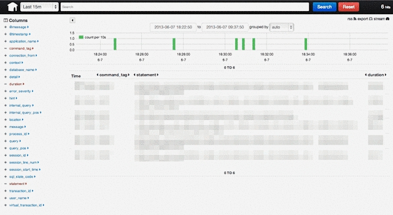

#######################################
PostgreSQLのログをfluentdで回収する設定
#######################################

.. author:: default
.. categories:: Programming
.. tags:: fluentd PostgreSQL
.. comments::

PostgreSQLのログをfluentd経由で回収するようにしたので設定を晒しておきます。ほぼ同じ設定を使いまわせるはずなので、fluentd & postgresの組み合わせを使っている人はどうぞ。

.. more::

************
PostgreSQL側
************

postgresql.conf
===============

postgresのログの設定はこんな感じ。

.. code-block:: none

    # csvlogを出力
    logging_collector = on
    log_destination = 'csvlog,stderr'

    # 1日でローテーション
    log_rotation_age = 1440

    # /var/log/pgsql/postgres-%Y%m%d.(log|csv)に出力
    log_directory = '/var/log/pgsql/'
    log_filename = 'postgres-%Y%m%d.log'

    # modeを644に
    log_file_mode = 0644

cron
====

fluentdが一意な名前で参照できるようにcronでシンボリックリンクを張り替えます。張替えの際の諸々はfluentdが面倒を見てくれるので心配いりません。

.. code-block:: none

    5 0 * * * postgres ln -sf /var/log/pgsql/postgres-$(date +'\\%Y\\%m\\%d').csv /var/log/pgsql/postgres.csv

*********
flunetd側
*********

postgresのcsvログは1レコード内に改行が含まれている可能性があるので、 `fluent-plugin-tail-multiline <https://github.com/tomohisaota/fluent-plugin-tail-multiline>`_ を利用します。

fluent-plugin-tail-multilineはtailに組み込みのパーサーは利用できないので正規表現で記述する必要があります。

.. code-block:: none

    <source>
      type        tail_multiline
      time_key    log_time
      time_format %Y-%m-%d %H:%M:%S.%L %Z
      path        /var/log/pgsql/postgres.csv
      tag         postgresql
      pos_file    /var/log/td-agent/postgresql.log.pos

      format_firstline /^\d{4}-\d{2}-\d{2}/

      format /^(?<time>[^,]*),"(?<user_name>.*)","(?<database_name>.*)",(?<process_id>[^,]*),"(?<connection_from>.*)",(?<session_id>[^,]*),(?<session_line_num>[^,]*),"(?<command_tag>.*)",(?<session_start_time>[^,]*),(?<virtual_transaction_id>[^,]*),(?<transaction_id>[^,]*),(?<error_severity>[^,]*),(?<sql_state_code>[^,]*),"(?<message>.*)",(?<detail>[^,]*),(?<hint>[^,]*),(?<internal_query>[^,]*),(?<internal_query_pos>[^,]*),(?<context>[^,]*),(?<query>[^,]*),(?<query_pos>[^,]*),(?<location>[^,]*),"(?<application_name>.*)"$/
    </source>

この設定をしておけば、こんな感じのメッセージが取れます

.. code-block:: none

   tag: postgres
   time: 2013-06-07 06:00:30 +0000
   record: {
     "application_name": "psql",
     "location": "",
     "query_pos": "",
     "query": "",
     "context": "",
     "internal_query_pos": "",
     "session_start_time": "2013-06-07 06:00:13 GMT",
     "command_tag": "SELECT",
     "session_line_num": "1",
     "session_id": "51b176ed.4f4e",
     "connection_from": "[local]",
     "process_id": "20302",
     "database_name": "my_database",
     "user_name": "postgres",
     "virtual_transaction_id": "109/0",
     "transaction_id": "0",
     "error_severity": "LOG",
     "sql_state_code": "00000",
     "message": "duration: 11002.537 ms  statement: select pg_sleep(11);",
     "detail": "",
     "hint": "",
     "internal_query": ""
   }

******
その後
******

この設定でログを全て集約できます。利用方法の例としては、スロークエリの検知などに使えますね。

その場合は、messageのフィールドにスロークエリ周りの情報がまとめて入ってしまっているので、 `fluent-plugin-rewrite-tag-filter <https://github.com/y-ken/fluent-plugin-rewrite-tag-filter>`_ でスロークエリとそれ以外でtagを振り分けた後に、 `fluent-plugin-parser <https://github.com/tagomoris/fluent-plugin-parser>`_ や `fluent-plugin-map <https://github.com/tomity/fluent-plugin-map>`_ などrecordを書き換えられるpluginでパースしてやればいいと思います。

****
追記
****

投げっぱなしも何なので、スロークエリのみを取り分けて、messageをパースして、結果を `Kibana <http://kibana.org/>`_ に入れるところまでの設定を書いておきます。Kibanaに入れておけば、検索はできるわ統計は取れるわでウハウハです。これからはfluentdにKibanaの時代ですね。

下記の設定だとスロークエリ以外のログは捨ててますが、一緒にKinabaに入れてもいいかもしれません。

.. code-block:: none

    <match postgresql>
      type rewrite_tag_filter

      rewriterule1 message ^duration: postgresql.slow_query
      rewriterule2 message .*         postgresql.others
    </match>

    <match postgresql.others>
      type null
    </match>

    <match postgresql.slow_query>
      type         parser
      add_prefix   parsed
      reserve_data yes
      key_name     message

      format /^duration: (?<duration>[0-9\.]+) ms  statement: (?<statement>.+)$/
    </match>

    <match parsed.postgresql.slow_query>
      type elasticsearch
      logstash_format true
    </match>

これだけの設定をしておけば、Kibanaに全部のスロークエリが入ってきます。

いい感じですね。ログはいざという時にパッと見れないと困るので、こうやっていつでも誰でも見れるようにしておくと捗りますね。
